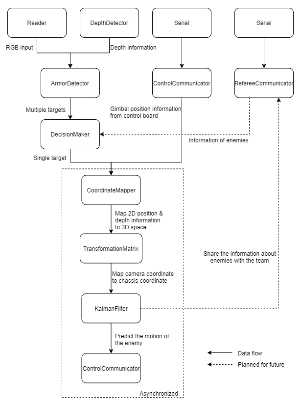

# Getting Started   

The algorithm team are incharged of two parts: the auto aim system and the sentry AI. 

### Auto Aim System
The Auto aim system aims to detect, model, predict enemy armor plate and communicate this information to the control board. 

### Sentry AI
TODO (Louis)
# Tools
## C++
C++ is the most commonly used language for the algo team. C++ is an Object-Oriented langue widely used due to it's fast execution time and ease of use. We uses C++ because of those properties, but also various packages available in C++ (ie. ROS, TensorRT, CUDA Kernel). 

A strong foundation in C++ is required as all of our implementation work will be in C++. Luckily, resources for learning C++ is widely available. 
- [learningcpp.com](https://www.learncpp.com/)  
- [Codecademy](https://www.codecademy.com/learn/learn-c-plus-plus)
- [Linux Command Cheetsheet](https://bjpcjp.github.io/pdfs/devops/linux-commands-handbook.pdf)

## Python

## Ubuntu (Linux) 
Ubuntu is a modern operating system derived from a branch of Linux. It is available with and without GUI. We uses Ubuntu as our platform's OS because it's the intended platform for ROS. 

It is vital that you are familiar with Linux command line interface. 

- [Ubuntu Tutorials](Tutorial：https://ubuntu.com/tutorials/command-line-for-beginners#1-overview)
- [Codecademy Command Line for the Raspberry Pi
](https://www.codecademy.com/learn/learn-raspberry-pi/modules/raspberry-pi-command-line-module/cheatsheet)

There are various way of setting up an Ubuntu environment. The easiest way would be to utilize the Windows Subsystem for Linux (WSL)
- [Install Linux on Windows with WSL](https://docs.microsoft.com/en-us/windows/wsl/install)

Some of the library we uses interface directly with the hardware, so a Virtual Machine or WSL may cause problem. A dual boot system can guarantee no issue in that regard. 
- [Install Ubuntu desktop](https://ubuntu.com/tutorials/install-ubuntu-desktop#1-overview)

## Git
Git is an distributed version control system. Trough out the season, you will collaborate with many others while writing code. Git will allow us to revert our code back to previous changes and enabling multiple people to work on the same repository. 

Knowing the basics of Git (commit, push, pull) is mandatory given it's importance. 

- [Pro Git Book](https://git-scm.com/book/en/v2)

## CMake
CMake is a tool for program compilation and linking. Most of our project utilized multitude of libraries and CMake can to simplify the compile and linking process greatly. It is also an requirement for ROS packages. 

- [CMake Official Guide](https://cmake.org/cmake/help/latest/guide/tutorial/index.html)

## OpenCV

## ROS

## Termios (UART) 

## Machine Learning

## CUDA Kernel 

## TensorRT