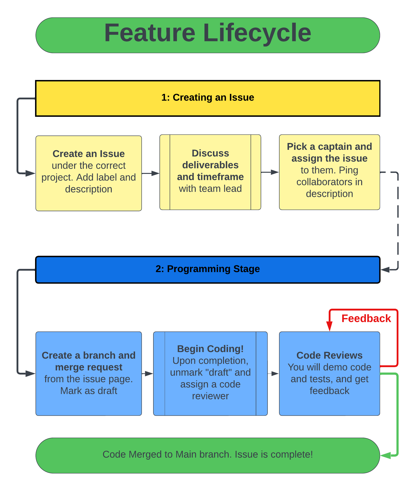

# How to Contribute Code

## **Feature lifecycle**: If a member wishes to work on an issue on GitLab, they must follow this process:
    
   - Pick one person to be the CAPTAIN of this issue, and assign the issue to them. Anyone else working on this issue should be pinged in the description. Do the same for each sub-task in the issue.
   - Still on the issue page, create a branch and merge request with the button in the top right. Make sure to mark it as a draft (it probably is by default) to not cause confusion.
   - You may begin coding! Upon completing your issue, unmark the “draft” checkbox in your merge request. Start a code review by assigning a code reviewer in the right panel.
   - The code reviewer will suggest improvements to your code, then will follow through with the merge. If you receive feedback, you should make the needed changes and notify the reviewer when you’re done.

    
## **What if I want to propose a new issue?:**
   
   - Create a new issue under the correct project. Add a good description and select an appropriate label. *Add  sub-tasks for each smaller deliverable if this is a larger project!*
   - Ping a code reviewer / team lead and discuss the issue with them. Work out a timeframe and deliverables.
   - A member is eventually assigned to the issue, and they are to begin the Feature Lifecycle process.
   
    
## **Code Evaluations**
 Before a code evalutation, the member should ensure:
 - The code is complete (all deliverables are met)
 - The code is documented (comments, README, etc.)
 - Merge request is un-marked as a draft

 Once the above is complete, the member should ping a team lead to schedule a code evaluation. The code evaluation process is as follows:
1. **Explain and demonstrate project:** show functionality to the team lead. 
   - Are all deliverables met? Does the code work as expected? 
   - Larger projects may take several rounds of tests to fully demonstrate.
2. **Analyze code:** together line-by-line
   - Static code analysis (conventions, clean code)
   - Review and verify test cases (do they cover core functionality and edge cases?)
   - Review and verify documentation (comments, README, etc.)
3. **Discuss Feedback:** If feedback is given, the member should re-mark the merge request as draft, complete the needed changes and notify the team lead when they’re done.
4. **Follow through with the merge to main**.

***

  

