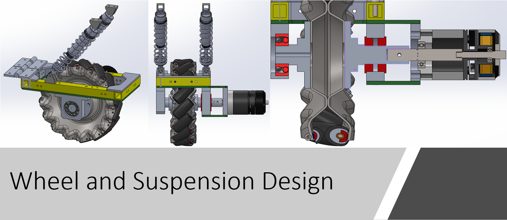
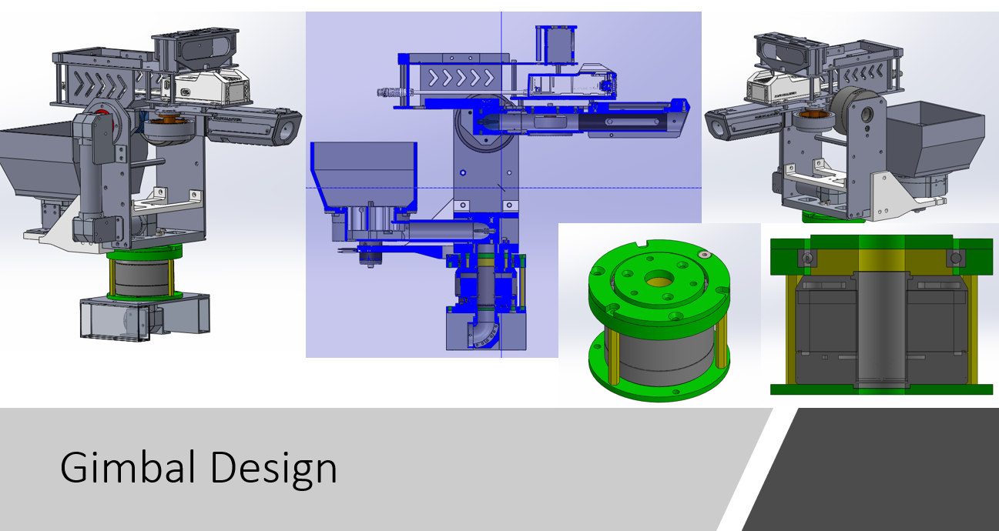
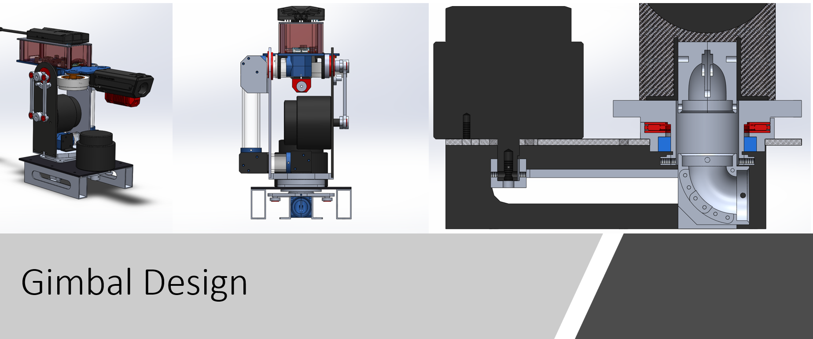

# Standard Robot Design
Here we present our past Standard Robot's designs and review some critical strcuture designs. 

 
## Standard Robot Building Parameters

| Item | Limit | Remarks|
| ------------- | ------------- | ------------- |
| Maximum Total Power Supply Capacity (Wh) | 200 | - |
| Maximum Power Supply Voltage (V) | 30 | - |
| Launching Mechanism | A 17mm Launching Mechanism | - |
| Projectile Supply Capability | Can only receive projectiles | - |
| Maximum Weight (kg) | 25 | Includes battery weight, but not the weight of the Referee System |
| Maximum Initial Size (mm, LxWxH) | 600x600x500 | Its orthographic projection on the ground should not exceed a 600*600 square |
| Maximum Expansion Size (mm, LxWxH) | 800x800x800 | Its orthographic projection on the ground should not exceed a 800*800 square |

## 3rd Generation
<!-- pictures -->

| Item | Features | Description|
| ------------- | ------------- | ------------- |
| Built Date | 2022 | RMUL |
| Design by| Zijian He (he348@purdue.edu)| [Download](https://drive.google.com/file/d/1YCemUNn1df2EkYXobL3D-QOv4Kax6j_P/view?usp=sharing) |
| Chassis | four-Wheel mecanum drive | Powered by [M3508 Motors](https://github.com/RoboMaster-Club/PurdueRM-Wiki/blob/gh-pages/docs/control/Useful%20Documents/Devices%20%26%20Datasheets.md)|
| Suspension | Independent suspension | - |
| Gimbal | Two-axis gimbal | Powered by [GM6020](https://github.com/RoboMaster-Club/PurdueRM-Wiki/blob/gh-pages/docs/control/Useful%20Documents/Devices%20%26%20Datasheets.md) |
| Projectile Tank | On the pitch axis | Close to the flywheels | 
| Shooting | M3508 Motors without gearbox | Side by side flywheels |
| Materials | Fiberglass, Aluminum | - |

### Actual Robot

### Chassis
<!-- pictures -->

This is a brand-new chassis compared to the 1st and 2nd gen Standards. We designed a structural frame by using 15x15x2 mm aluminum tubes. Instead of welding them together, we designed some "L" and "T" shape fiberglass plates to connect all the tubes. 

### Wheel and Suspension
<!-- pictures -->

We gave up the four-bar linkage suspension system because the manufacturing cost was high, and it wasn't easy to fix when some parts failed. Therefore, we designed a two-side supporting wheel and suspension system. A Mecanum wheel is supported and connected in this system by a hub on each side, like a sandwich. Bearings support the hub on each side. Two flange deep-groove ball bearings support the side connected to the motor. To ensure the bearing on both sides is coaxial, a self-aligning ball bearing is placed on another side to support the hub. 

### Gimbal - Yaw
<!-- pictures -->

We integrated a slip ring in the middle of this new yaw-axis design to pass through all the signal and power wires from the chassis to the compononts above the yaw axis. In this case, we are able to spin the gimbal around the yaw axis without any angle limitations. A cross roller bearing supports the hub of this yaw axis, which can handle radial, thrust and moment loads at the same time. The slip ring has 24 cahnnels. 

### Gimbal - Pitch
<!-- pictures -->

Like the 1st generation standard robot, we moved the pitch-axis motor from the top to the gimbal's side to lower the center of gravity. We used a two-bar linkage to manipulate the pitch axis, and the mounting point is closer to the bullet tank.

 ### Projectile Shooting and Feeding
<!-- pictures -->

We used M3508 motors to power the flywheels, but we disassembled the planetary gearbox so that they could reach to highest rpm. We customized two Polyurethane(PU) friction wheels with D55 hardness, mounting them to those two motors to shoot projectiles.

An [M2006](https://github.com/RoboMaster-Club/PurdueRM-Wiki/blob/gh-pages/docs/control/Useful%20Documents/Devices%20%26%20Datasheets.md) motor powers a rotor inside the tank to feed the projectiles one by one toward the flywheels. We faced projectile jamming at the tank exit during the competition. We solved this problem by placing some soft material on the top of the exit to stop projectiles from falling down to the exit. 

## 2nd Generation
<!-- pictures -->

| Item | Features | Description|
| ------------- | ------------- | ------------- |
| Built Date | 2019&2022 | RMUC&ICRA |
| Design by| Zijian He (he348@purdue.edu)| [Download](https://drive.google.com/file/d/16ofBFMMkNPYAw_EBsra_WVcw6TAeH8vW/view?usp=sharing) |
| Chassis | four-Wheel mecanum drive | Powered by [M3508 Motors](https://github.com/RoboMaster-Club/PurdueRM-Wiki/blob/gh-pages/docs/control/Useful%20Documents/Devices%20%26%20Datasheets.md)|
| Suspension | Independent suspension | - |
| Gimbal | Two-axis gimbal | Powered by [GM6020](https://github.com/RoboMaster-Club/PurdueRM-Wiki/blob/gh-pages/docs/control/Useful%20Documents/Devices%20%26%20Datasheets.md) |
| Projectile Tank | Under the gimabl| Chain route from bottom to top | 
| Shooting | Two drone propeller motors | Side by side flywheels |
| Materials | Fiberglass, Aluminum | - |

### Actual Robot

### Chassis
We kept using the chassis from last version of Standard. We made slightly changes on mounting holes to fit our new gimbal design.

### Gimbal

Gimbal system is a mainly update of 2nd generation Standard. We replaced the older gimbal motor by [GM6020](https://www.robomaster.com/en-US/products/components/general/gm6020/info). The motor adopts a hollow shaft design that offers high torque density, control precision, flexible interaction methods, and intelligent protection. 

## 1st Generation
<!-- pictures -->

| Item | Features | Description|
| ------------- | ------------- | ------------- |
| Built Date | 2019 | RMUC |
| Chassis | four-Wheel mecanum drive | Powered by [M3508 Motors](https://github.com/RoboMaster-Club/PurdueRM-Wiki/blob/gh-pages/docs/control/Useful%20Documents/Devices%20%26%20Datasheets.md)|
| Suspension | Independent suspension | - |
| Gimbal | Two-axis gimbal | Powered by RM6025 |
| Projectile Tank | Under the gimabl | Chain route from bottom to top | 
| Shooting | Two drone propeller motors | Side by side flywheels |
| Materials | Carbon fibers, Stainless steel frame, Aluminum | - |

### Acutal Robot
 

### Chassis
<!-- pictures -->
 

Couple large carbon-fiber sheets are supported by a welded stainless-steel frame. A T-shape bumper front of the robot chassis to protect suspension from the collsion. Four vertical standoff are mounted on the bottom plate and top plate of the chassis in order to solidly support the suspension system. 

### Wheel and Suspension
<!-- pictures -->
 

A 4-link suspension system was designed for 1st generation Standard. There are two reasons to install a suspension system in our chassis. First, we are using Mecanum wheels, so we have to ensure the robot's four wheels are firmly attached to the ground to help the control team better program the chassis's motion. Secondly, there are some bumps on the battlefield. A suspension can help the robot to eliminate significant vibration and protect the robot. 

The Mecanum wheel is connected to the motor by an aluminum hub. Even though this hub solidly connects a wheel and M3508 motor, two flange deep-groove ball bearings (red in the picture) support the hub shaft to accommodate radial load from the chassis and protect the output shaft of the motor. 

### Gimbal
<!-- pictures -->

Two strategies are applied to reduce the load on both yaw and pitch axis motors. 
 - A four-bar linkage is utilized to actuate both axes, as well as saves space and lower the center of gravity
 - Projectile tank is placed on the chassis instead of on the pitch axis, so it highly reduces the inertia of the pitch axis.

A needle roller thrust bearing(red) and a deep-groove ball bearing (blue)  are placed on the yaw axis. The needle roller thrust bearing can be fitted to a small space but support a large axial load. By combing thrust bearing and deep-groove bearing, which predominantly supports the radial load, we can well fit and mobilize the gimbal yaw axis.

 ### Projectile Shooting and Feeding
 

Projectiles are fed by a rotor through the middle of the yaw axis, passed through the pitch axis, and finally arrive at the flywheels. Two flywheels are aligned side by side. The distance between two flywheels is smaller than the projectiles' diameter, so the projectiles can be squeezed forward and launched out of the barrel. 