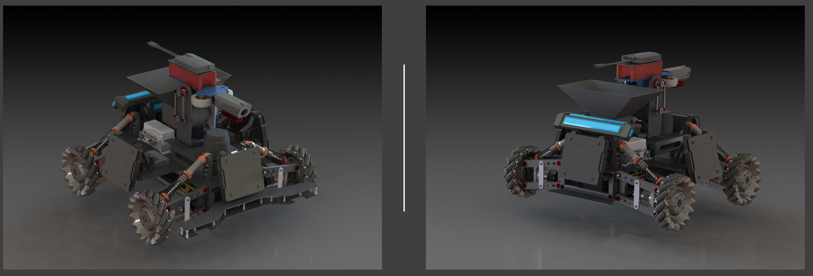
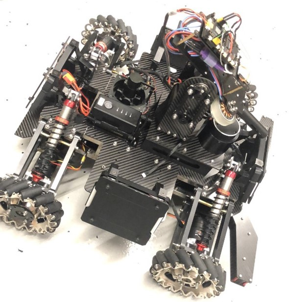

# Standard Robot Design
Here we present our past Standard Robot's designs and review some critical strcuture designs. 

## Standard Robot Building Parameters

| Item | Limit | Remarks|
| ------------- | ------------- | ------------- |
| Maximum Total Power Supply Capacity (Wh) | 200 | - |
| Maximum Power Supply Voltage (V) | 30 | - |
| Launching Mechanism | A 17mm Launching Mechanism | - |
| Projectile Supply Capability | Can only receive projectiles | - |
| Maximum Weight (kg) | 25 | Includes battery weight, but not the weight of the Referee System |
| Maximum Initial Size (mm, LxWxH) | 600x600x500 | Its orthographic projection on the ground should not exceed a 600*600 square |
| Maximum Expansion Size (mm, LxWxH) | 800x800x800 | Its orthographic projection on the ground should not exceed a 800*800 square |

## 1st Generation

| Item | Features | Description|
| ------------- | ------------- | ------------- |
| Built date | 2019 | RMUL |
| Chassis | four-Wheel mecanum drive | Powered by [M3508 Motors](https://github.com/RoboMaster-Club/PurdueRM-Wiki/blob/gh-pages/docs/control/Useful%20Documents/Devices%20%26%20Datasheets.md)|
| Suspension | Independent suspension | - |
| Gimbal | Two-axis gimbal | Powered by RM6025 |
| Projectile Tank | Under the gimabl | Chain route from bottom to top | 
| Shooting | Two drone propeller motors | Side by side flywheels |
| Materials | Carbon fibers, Stainless steel frame, Aluminum | - |

### Acutal Robot
 

### Chassis

<!-- pictures -->
Chassis
 

Couple large carbon-fiber sheets are supported by a welded stainless-steel frame. A T-shape bumper front of the robot chassis to protect suspension from the collsion. Four vertical standoff are mounted on the bottom plate and top plate of the chassis in order to solidly support the suspension system. 

### Suspension

<!-- pictures -->
 

A 4-link suspension system was deisgned for 1st generation Standard. There are two reasons to install a suspension system in our chassis. First, we are using Mecanum wheels, so we have to ensure robot's four wheels are firmly attached to the gound to help the control team better programming the chassis's motion. Secondly, there are some small bumps in the battle field. A suspension can help the robot to eliminate large vibration and protect robot. 

The Mecanum wheel is connected to the motor by a aluminum hub. Even though this hub solidly connects a wheel and M3508 motor, two flange deep-groove ball bearings (red in picture) are supporting the hub shaft to accommodate radial load from the chassis, and protect the output shaft of the motor. 

### Gimbal

<!-- pictures -->

Two strategies are applied to reduce the load on both yaw and pitch axis motors. 
 - A four-bar linkage is utilized to actuate both axis, as well as saves the space and lower the center of gravity
 - Projectile tank is placed on the chassis instead of on the pitch axis, so it highly reduce the inertia of the pitch axis.

A needle roller thrust bearing(red) and a deep-groove ball(blue) bearing are placed on yaw axis. The needle roller thrust bearing can be fitted to a small space but support a large axial load. By combing thrust bearing and deep-groove bearing, predominantly supports radial load, we can well fit amd mobilize the gimbal yaw axis. 

 ### Projectile Shooting & Feeding
 
