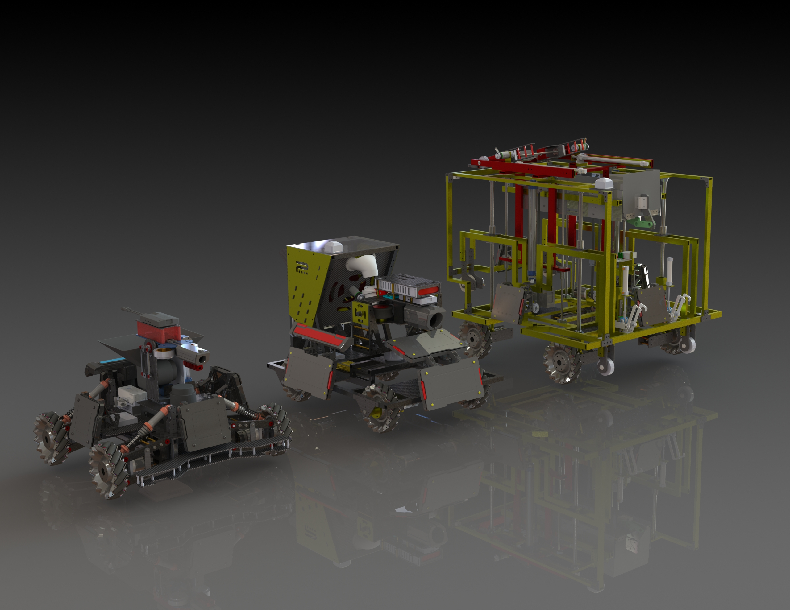

# Robot Design

<!-- Here we are going to show you robot design specifications and review our past robot design. 

## Design Tool
- SolidWorks

## Overview of Robot Fleet
There are **7** different kinds of robots in total in [RoboMaster University Championship (RMUC)](https://www.robomaster.com/en-US/robo/rm?djifrom=nav). They are **Standard**, **Hero**, **Engineer**, **Sentry**, **Aerial**, **Dart System** and **Radar**. However, the North America region is only hosing [RoboMaster University League (RMUL)](https://www.robomaster.com/en-US/robo/college-league?djifrom=nav) competition, which includes 3V3 Confrontation and Standard Confrontation.

In the "3V3 Confrontation", participating teams need to independently develop Standard, Hero and Sentry to participate in tactical battles in the designated battlefield and participate in tactical battles in the designated battlefield. Participants control their robots to attack enemy’s robots and Base by launching projectiles. At the end of the match, the team with the highest remaining Base HP wins.

In the "Standard Confrontation", Standards from each team (1V1) fight against each other by shooting the Armor Modules. At the end of the match, the team with the highest remaining Standard HP wins.

### Standard
Also named as Infantry Robot, launching 17mm projectiles and acting as the major output unit at the battlefield. Three Standards are allowed to present in RMUC, and two Standards are allowed to present in 3v3 of RMUL

### Hero
Launching 42mm projectiles at the opponents to cause a larger amount of damage. One Hero robot is allowed in 3v3 of RMUL

### Engineer
Engineer Scrambles for resources and resurrects teammates

### Sentry
Fully automatic and moving along the Sentry rail to defend the base. One Sentry is allowed in 3v3 of RMUL

### Aerial
Providing air support and a bird view for the entire team

### Dart System
Launching Darts to attack enemy's Output and Base

### Radar
Equipped with the most excellent computing power to provide vision and warning information to the entire team -->